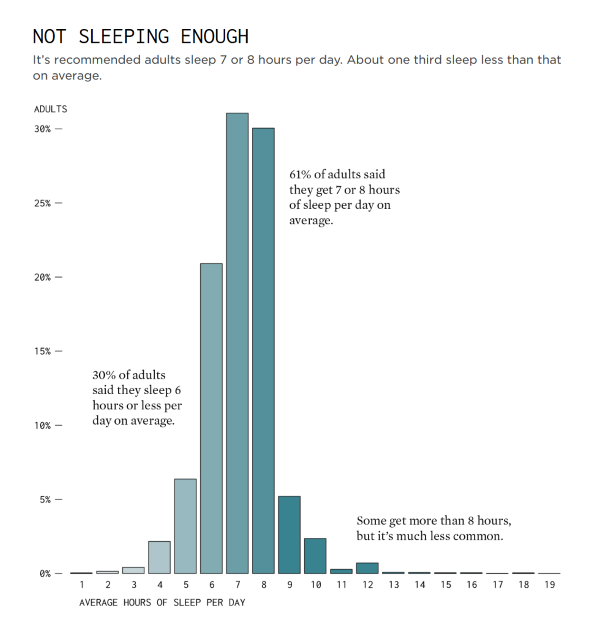

# **Visualization:** [Not Sleeping Enough](https://flowingdata.com/2024/04/18/sleep-hours-and-feeling-rested/)

## Overview

This critique evaluates a bar chart published by
[FlowingData](https://flowingdata.com/) that presents the distribution
of self-reported adult sleep duration in comparison with commonly
recommended sleep ranges. While the visualization appears simple and
attractive at first, a more through analysis reveals specific strengths
and limitations. This critique applies the five established principles
of effective data visualization: **`truthfulness`, `functionality`,
`beauty`, `insight`, and `enlightenment`.**

## 1. Is it Truthful?

**A truthful visualization accurately represents the data on which it is
based and avoids misleading implications.** *This chart succeeds in
giving a general sense of how many hours adults report sleeping, using
clearly marked bars and labels that suggest a grounding in survey
responses*. However, the visualization does not fully support its claims
with verifiable evidence.

The primary shortcoming is *the absence of methodological transparency*.
No information is provided on the source of the data, the survey sample
size, or how the responses were collected. Without this information,
viewers cannot determine whether the figures are representative of a
broader population or limited to a specific subset. This omission raises
uncertainty regarding the robustness of the data.

Furthermore, *the alignment between the labelled annotations and the
corresponding bars is imprecise*. For example, the note stating that “30
percent of adults said they sleep 6 hours or less” does not clearly
correspond to the height of the relevant bars. It remains unclear
whether these annotations refer to individual categories or grouped
values, which weakens confidence in the chart’s internal consistency.

In sum, although the visualization avoids outright distortion, its lack
of clarity about the data source and methods diminishes its
truthfulness. Without contextual detail, viewers may misinterpret the
figures as more precise or authoritative than they are.

## 2. Is it Functional?

**A functional visualization allows viewers to quickly and accurately
extract the intended information**. In this respect, the bar chart
provides a basic overview of the distribution of sleep duration among
adults. Each bar represents a discrete number of sleep hours, and the
layout supports a direct comparison across categories.

Despite this general clarity, several design choices reduce its
functional effectiveness. The annotations, while helpful in highlighting
key observations, are placed in a way that may cause confusion. Their
proximity to specific bars creates a visual association, even when the
text describes aggregated values across multiple bars. This risks
misinterpretation, particularly by viewers who may not read the chart
with critical attention.

In addition, the use of a color gradient may lead a viewer to assume
that color conveys meaning. There is no legend or accompanying
explanation, leaving it uncertain whether the gradient is intended to
communicate sequential ordering, categorical distinctions, or purely
aesthetic enhancement. This ambiguity reduces from the chart’s
interpretability.

A simple caption explaining the color choice and the meaning of the
annotations would have resolved these uncertainties. Currently, the
chart’s functionality is partially compromised by this omission.

## 3. Is it Beautiful?

**A beautiful visualization should be visually appealing without
detracting from clarity or distorting meaning**. In this case, *the
visual design is elegant. The typography is clean, the use of space is
generous, and the visual balance of the chart draws the viewer’s
attention appropriately to the data*.

The color palette, featuring a soft gradient, creates a visually
pleasing effect and enhances the professional appearance of the chart.
The design choices engages, and there is a sense of coherence between
the graphical elements.

However, *the aesthetic strength of the chart also introduces a minor
weakness*. The color gradient, though visually attractive, lacks a clear
purpose. Its inclusion creates the illusion of additional meaning
without actually conveying information. In visualization, decorative
choices that are not anchored in meaning can lead to distraction or
misinterpretation.

A more restrictive color scheme, using a single neutral tone or a
limited set of categorical colors to mark specific ranges, would have
preserved the chart’s beauty while reinforcing its clarity.

## 4. Is it Insightful?

**An insightful visualization helps the viewer see patterns or
relationships that were previously unclear**. In this respect, the chart
provides useful information. It shows that a majority of adults report
sleeping between seven and eight hours per night, which aligns with
commonly recommended health guidelines. It also reveals that a
significant proportion of respondents sleep less than six hours, which
suggests a potential area of public health concern.

The inclusion of concise annotations adds value, guiding the viewer
toward relevant interpretations. The remark that more than 60% of
respondents fall within the seven to eight hour range is one such
example. These annotations support a correct reading of the distribution
and help direct attention to patterns of interest.

However, certain addition such as grouping the data could enhance the
insights. For instance, the data could have been grouped to reflect
meaningful thresholds, such as hours of sleep below the recommended
range, within the optimal range, and above the recommended range. This
would have supported a more immediate understanding of the extent to
which the population aligns with or deviates from public health
standards.

## 5. Is it Enlightening?

**An enlightening visualization extends the viewer’s understanding by
connecting data to broader contexts or prompting further inquiry**.
While the current chart informs the viewer about self-reported sleep
duration, it does not deepen understanding of the causes, consequences,
or demographic variations associated with the trend.

The chart prompts reflection on the fact that many adults sleep less
than recommended, but it does not explore what this means. It does not
address differences across age, occupation, income level, or geographic
region. Nor does it link the findings to health outcomes such as
fatigue, productivity, or disease risk. As a result, it is informative
but not enlightening.

## How I Would Improve It

If I were to redesign this visualization, I would make the following
changes.  

- First, I would include a caption specifying the data source, sample
  size, and collection method to enhance truthfulness.
- Second, I would replace the color gradient with a single neutral tone
  or use clearly explained categorical colors to distinguish between
  sleep duration below, within, and above the recommended range.
- Third, I would reposition the annotations so that they do not appear
  to label specific bars.
- Fourth, I would consider using a cumulative distribution or grouped
  bar design to emphasize key thresholds.  

I belive that these changes would maintain the chart’s visual appeal
while improving clarity, insight, and reliability.

## Summary

This visualization succeeds in offering a clear and visually attractive
summary of sleep duration among adults. It engages the viewer and
presents a relevant public health concern. Although, the absence of
methodological detail, the ambiguity of the color scheme, and the
underdeveloped framing of insights limit its impact. With minor
adjustments, the visualization could become a more truthful, insightful
and enlightening .

------------------------------------------------------------------------

### Why this version is *Excellent*:

- **Analytically rigorous**: Each critique is supported by clear
  reasoning and examples.
- **Precise language**: Uses formal, specific terms
  (e.g. “methodological transparency”) to convey arguments clearly.
- **Structured and layered**: Builds insights step-by-step, not just
  stating flaws but explaining *why* they matter.
- **Evaluative**: Makes strong, defensible judgments instead of being
  nebulous.
- **Improvement suggestions are targeted**: Each proposal is connected
  to a specific weakness.
