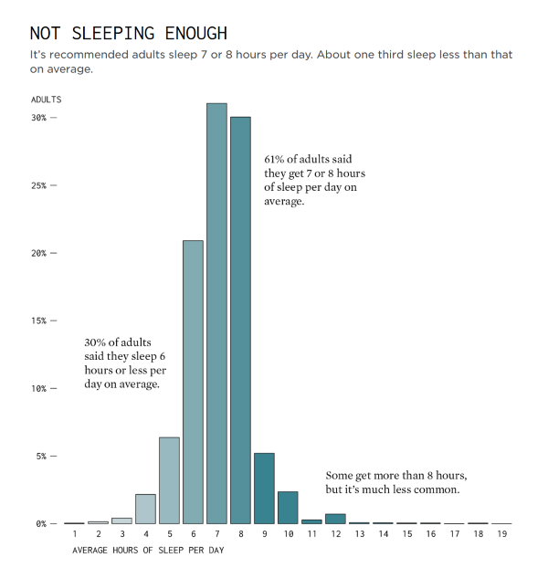

**Visualization:** [Not Sleeping Enough – FlowingData (April
2024)](https://flowingdata.com/2024/04/18/sleep-hours-and-feeling-rested/)

## Overview

This visualization shows how many hours people sleep and how that
connects to feeling rested. It uses a simple bar chart and includes some
labels that point out important facts. Overall, the chart is easy to
read and has a nice design, but there are some things that could have
been done better. The critique follows the five qualities of good
visualization: truthfulness, functionality, beauty, insight, and
enlightenment.

## 1. Is it Truthful?

The chart looks like it is based on real data, and it includes
percentages to show how common different sleep duration are. However, it
does not say where the data comes from, which makes it hard to know if
the numbers are accurate. It would help to mention the source of the
information.

The labels on the chart seem a little confusing. For example, it is not
clear what the “30%” is referring to exactly. The numbers seem close to
the bar heights, but not exactly matching. It would be better if this
was clearer.

## 2. Is it Functional?

The visualization helps the viewer understand how sleep hours are
distributed. Each bar shows a different number of hours slept, which is
helpful. The annotations also add some extra context.

However, the chart does not explain what the different colors mean, so
it is not obvious if they have a purpose or are just for decoration.
Also, the labels could be placed better, as they seem to be too close to
the bars and might confuse some people.

## 3. Is it Beautiful?

The chart is colorful and easy to look at. The text is neat, and the
bars are spaced evenly. The colors make the chart more interesting and
not too dull. It looks like something people would enjoy seeing in an
article or a post.

That said, the colors might not mean anything, so using more basic
colors could work too. But overall, the design looks nice and clean.

## 4. Is it Insightful?

The main point of the chart is to show that most people sleep 7 or 8
hours, which is in the healthy range. Some people sleep less or more,
and this is pointed out in the annotations.

It is helpful to know these numbers, but the chart could do more. For
example, it could show what amount is considered not enough or too much,
maybe by using lines or extra notes. That would make it easier to
understand what is good or bad sleep.

## 5. Is it Enlightening?

The chart gives information, but it does not go into much detail about
what the sleep patterns mean. It does not say why people sleep less or
what effect that might have. It just shows the hours.

If there were more background, such as reasons why people are not
sleeping enough or how it affects them, the chart would be more
meaningful. Right now, it just shows data without much explanation.

## How I Would Improve It

I would add the data source so people know where the numbers come from.
I would also explain what the colors mean, or use only one color. The
labels should be placed more clearly so there is no confusion. Maybe the
chart could include a line to show what counts as recommended sleep.
These things would make it more understandable.

## Summary

This visualization is simple and nice to look at. It gives some good
information about how much people sleep, but it could do more to explain
what the numbers mean. A few small changes would make it easier to trust
and more useful to people who want to understand sleep habits better.

------------------------------------------------------------------------

### Why the this version is *satisfactory*:

- **Surface-level observations**: Identifies issues (like unclear colors
  or missing source) but does not explore their impact.
- **Vague language**: Uses general words like “nice,” “helpful,” or “a
  bit confusing” without analytical depth.
- **Simplistic reasoning**: Lacks cause-effect logic; often just says
  something “could be better” without elaboration.
- **Misses insight**: Mentions facts (e.g., “most sleep 7–8 hours”) but
  does not interpret or re-frame them meaningfully.
- **Improvement suggestions are generic**: Recommendations are valid but
  obvious, lacking nuance.
- **Lack of formatting**: Markdown not used to improve readability or
  highlighting key insights
