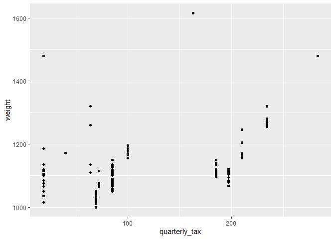

# Introduction

The data used for this assignment is from a listing of **Toyota
Corolla** offered for resale in the year **2004**, possibly in the
**Netherlands**. The total number of entries in this dataset is
***1436***.

Given that data is a subset of all cars in the Netherlands, it is
expected that trends in this data are influenced by **Dutch policy**,
therefore a discussion of such is of ***utmost importance*** so that we
can narrow down the field of inquiry. Back then, ***tax rates were
proportional to the weight of the vehicle***. So, weight and tax are
expected to be **strongly correlated**.

Additionally, diesel cars being heavier than petrol, were liable to
**increased taxation**. However, since diesel fuel was ***cheaper
enough*** that long-distance drivers still often chose diesel over
petrol, which contributed to the demand for diesel vehicles, translating
to the **resale value** of diesel cars.

All in all, one can expect to see an **interplay** between Dutch policy
that made diesel vehicles costly on one hand while the lower fuel cost
made them more affordable. Both these ***opposing factors*** are
expected to drive the resale prices of cars.

Though it must be noted that there will always be **outliers** that
dominate any dataset. For example:

• The **age** of a car  
• The **number of kilometers driven**

These factors will eventually outweigh the fuel type.

For this particular assignment we will focus on:

• **Distribution of cars by fuel type** (categorical plot)  
• **Verification of the relationship between taxes and weight**
(continuous plot) which we expect to be ***positively correlated***

In the later part of the assignment other hypotheses will be explored to
test the factors that drove the **resale value**.

``` r
library(tidyverse)
library(ggExtra)
library(ggridges)
library(scales)
library(ggpubr)
library(scales)
library(ggtext) 
library(ggthemes)
```

``` r
# load the data
dataPath = "./data/ToyotaCorolla.csv"
corolla <- read_csv(dataPath) |> janitor::clean_names()
```

    ## Rows: 1436 Columns: 39
    ## ── Column specification ────────────────────────────────────────────────────────
    ## Delimiter: ","
    ## chr  (3): Model, Fuel_Type, Color
    ## dbl (36): Id, Price, Age_08_04, Mfg_Month, Mfg_Year, KM, HP, Met_Color, Auto...
    ## 
    ## ℹ Use `spec()` to retrieve the full column specification for this data.
    ## ℹ Specify the column types or set `show_col_types = FALSE` to quiet this message.

``` r
head(corolla)
```

    ## # A tibble: 6 × 39
    ##      id model price age_08_04 mfg_month mfg_year    km fuel_type    hp met_color
    ##   <dbl> <chr> <dbl>     <dbl>     <dbl>    <dbl> <dbl> <chr>     <dbl>     <dbl>
    ## 1     1 TOYO… 13500        23        10     2002 46986 Diesel       90         1
    ## 2     2 TOYO… 13750        23        10     2002 72937 Diesel       90         1
    ## 3     3 TOYO… 13950        24         9     2002 41711 Diesel       90         1
    ## 4     4 TOYO… 14950        26         7     2002 48000 Diesel       90         0
    ## 5     5 TOYO… 13750        30         3     2002 38500 Diesel       90         0
    ## 6     6 TOYO… 12950        32         1     2002 61000 Diesel       90         0
    ## # ℹ 29 more variables: color <chr>, automatic <dbl>, cc <dbl>, doors <dbl>,
    ## #   cylinders <dbl>, gears <dbl>, quarterly_tax <dbl>, weight <dbl>,
    ## #   mfr_guarantee <dbl>, bovag_guarantee <dbl>, guarantee_period <dbl>,
    ## #   abs <dbl>, airbag_1 <dbl>, airbag_2 <dbl>, airco <dbl>,
    ## #   automatic_airco <dbl>, boardcomputer <dbl>, cd_player <dbl>,
    ## #   central_lock <dbl>, powered_windows <dbl>, power_steering <dbl>,
    ## #   radio <dbl>, mistlamps <dbl>, sport_model <dbl>, backseat_divider <dbl>, …

# Categorical Plots

## 1. Simple count plot of cars by fuel type

The fuel-type mix in the data shows ***significant imbalance***. Almost
all the cars use **petrol** as fuel. **Diesel** is a distant second and
**CNG** cars are rare. Apparently, Toyota offerings were mostly petrol
or perhaps this may simply be an ***idiosyncrasy*** of the data, we
shall perhaps never know. But the **bias** is worth noticing, since it
means the rest of the plots will mostly reflect petrol cars unless we
split or facet by fuel type. This context will be ***important*** while
interpreting significant effects.

``` r
corolla |> 
  ggplot(aes(fuel_type)) +
  geom_bar()
```

<!-- -->

## 2. Pie chart as an alternative

To emphasize the ***extreme imbalance*** a pie chart can be used. Pie
charts are usually **decried** over bar plots because humans are
incapable of visually interpreting angles in the pie over the height of
the bar. But here they will serve the purpose of ***exaggerating the
imbalance*** in the data, namely the **dominance of petrol cars**.

``` r
# Calculate percentages and label positions
fuel <- corolla |> 
  count(fuel_type) |> 
  mutate(
    pct = n / sum(n),
    label = paste0(fuel_type, "\n", round(pct * 100, 1), "%") # Create label with fuel type and percentage
  ) |> 
  arrange(desc(n)) |> 
  mutate(ypos = cumsum(pct) - 0.5 * pct) # Calculate cumulative positions for label placement
fuel
```

    ## # A tibble: 3 × 5
    ##   fuel_type     n    pct label            ypos
    ##   <chr>     <int>  <dbl> <chr>           <dbl>
    ## 1 Petrol     1264 0.880  "Petrol\n88%"   0.440
    ## 2 Diesel      155 0.108  "Diesel\n10.8%" 0.934
    ## 3 CNG          17 0.0118 "CNG\n1.2%"     0.994

``` r
fuel |>  
  ggplot(aes(x = "", y = pct, fill = fuel_type)) +
  geom_bar(stat = "identity") +
  coord_polar("y")
```

<!-- -->

## 3. Enhanced donut chart with improved aesthetics

The pie chart by itself is not **aesthetically pleasing**. Not only
that, there are a few things such as the **grid lines** and the
**background** that can be cleaned up. As an improvement a ***donut
chart*** can be used instead. As a good practice the following
enhancements have been added:

• **Custom theme**  
• **Color palette**  
• **Annotations**  
• **Title and subtitle**

``` r
# Hole size
hsize <- 2

ggplot(fuel, aes(x = hsize, y = pct, fill = fuel_type)) +
  geom_col(color = "white") +
  geom_text(aes(label = label, y = ypos), x = hsize + 1, size = 4) +
  coord_polar(theta = "y") +
  scale_fill_brewer(palette = "GnBu") +
  xlim(c(0, hsize + 1)) +
  theme_void() +
  theme(
    legend.position = "none",
    plot.title = element_text(face = "bold", size = 15),
    plot.subtitle = element_text(size = 10, color = "grey30")
  ) +
  labs(
    title = "Toyota Fuel Type Distribution",
    subtitle = "Petrol dominates the market, with Diesel far behind and CNG almost absent"
  )
```

<!-- -->

## Bonus : The same using ggpubr library

``` r
library(ggpubr)

 
donut_plot <- ggdonutchart(fuel, "pct", label = "label", lab.font = c(4, "plain", "black"),
      fill = "fuel_type", color = "white", palette = "GnBu")
donut_plot
```

<!-- -->

``` r
donut_plot +
  theme(
    legend.position = "none",
    plot.title = element_text(face = "bold", size = 15),
    plot.subtitle = element_text(size = 10, color = "grey30")
  ) +
  labs(
    title = "Toyota Fuel Type Distribution",
    subtitle = "Petrol dominates the market, with Diesel far behind and CNG almost absent\nn=1436"
  )
```

<!-- -->

# Continuous Variables

## Trend between quarterly tax and weight

### 1. Scatter plot

The scatter plot reveals that ***tax increases as the weight goes up***,
but the tax is not **proportional** to weight, rather there are ***tax
slabs*** as we can see most of the points are clustered at **discrete
values**. This suggests the next step to visualize this better:
***create tax buckets***.

``` r
# relationship between weight and quarterly tax
corolla |> 
  ggplot(aes(quarterly_tax, weight)) +
  geom_point()
```

<!-- -->

## 2. Boxplot of Tax Band vs Weight of car

``` r
(corolla_subset <- corolla |>
  select(weight, quarterly_tax, fuel_type) |> # select the required columns
  mutate(
    tax_band = factor(case_when( # create tax bands 
    quarterly_tax < 100 ~ "low",
    between(quarterly_tax, 100, 200) ~ "medium",
    quarterly_tax >= 200 ~ "high"), levels = c("low", "medium", "high"), ordered = TRUE),
    weight_bin = factor(case_when(  # additionally create weight bins
      weight < 1150 ~ "light",
      weight >= 1150 ~ "heavy"),
      levels = c("light", "heavy"), ordered = TRUE)
    )
  )
```

    ## # A tibble: 1,436 × 5
    ##    weight quarterly_tax fuel_type tax_band weight_bin
    ##     <dbl>         <dbl> <chr>     <ord>    <ord>     
    ##  1   1165           210 Diesel    high     heavy     
    ##  2   1165           210 Diesel    high     heavy     
    ##  3   1165           210 Diesel    high     heavy     
    ##  4   1165           210 Diesel    high     heavy     
    ##  5   1170           210 Diesel    high     heavy     
    ##  6   1170           210 Diesel    high     heavy     
    ##  7   1245           210 Diesel    high     heavy     
    ##  8   1245           210 Diesel    high     heavy     
    ##  9   1185           100 Petrol    medium   heavy     
    ## 10   1105           185 Diesel    medium   light     
    ## # ℹ 1,426 more rows

``` r
corolla_subset |> 
  ggplot(aes(tax_band, weight)) +
  geom_boxplot()
```

<!-- -->

### 3. Refinement

The previous plot can be improved by adding:

• **Custom theme**  
• **Color palette**  
• **Annotations**  
• **Title and subtitle**

Considering the ***imbalance in the data***, the **group size** has also
been added to the plot so that viewers are ***cautious of interpreting
the effects as significant*** without considering the group size.

``` r
corolla_subset |> 
  ggplot(aes(tax_band, weight, fill = tax_band)) +
  geom_boxplot(width = 0.5, linewidth = 0.3) +
  scale_fill_brewer(palette = "GnBu") +
  scale_x_discrete(labels = function(x){
    counts <- table(corolla_subset$tax_band)
    paste0(x, "\n(n=", counts[x], ")")
  } ) +
  labs(
    title = "Weight Distribution by Tax Band",
    subtitle = "Heavier vehicles pay more taxes. Though sample size may hinder interpretation",
    x = "Tax Band",
    y = "Weight (kg)"
  ) +
  theme_pubr() +  
  theme(
    legend.position = "none",
    axis.title.x = element_text(margin = margin(t = 15)),
    axis.title.y = element_text(margin = margin(r = 15)),
    plot.subtitle = element_text(margin = margin(b = 15), color = "grey30", size = 10),
    plot.title = element_text(size = 15, face = "bold")
  ) 
```

<!-- -->
