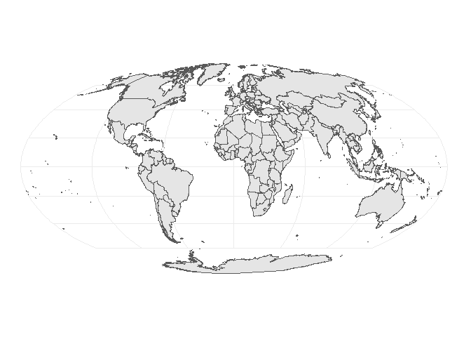
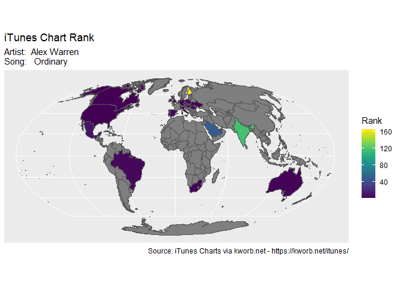
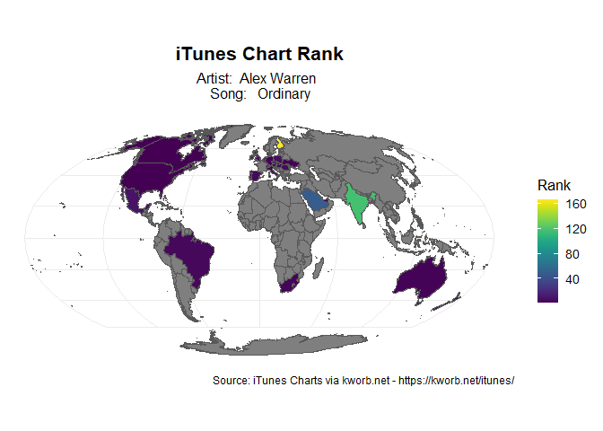

``` r
library(countrycode) # convert from ISO 2 to ISO 3 codes
library(rnaturalearth) # provides tools for maps
library(rnaturalearthdata) # provides shapefile
library(sf) # read shapefiles
library(skimr) # used for summary
library(viridis) # used for making pretty choropleth
library(tidyverse) # provides ggplot and dplyr verbs
```

# Introduction

The dataset represents global chart rankings from the iTunes platform,
capturing how individual songs perform across different countries. Each
row corresponds to a song and includes metadata such as artist and
title, number of days on the chart, peak position, and point-based
performance indicators. Following these are columns for country-specific
chart positions, using ISO Alpha-2 country codes. A numeric value in a
country column indicates the song’s rank in that nation’s iTunes chart,
while missing values imply the song did not chart there. Although
labeled as “global,” the dataset reflects usage patterns specific to
iTunes, a platform whose adoption varies significantly across regions.
As such, the dataset provides a window into iTunes-specific music trends
rather than a complete picture of global music consumption.

# Load the data

- Each row is an individual song followed by the metrics such as Days,
  Pts (Points), TPts (Total Points), and two letter country code (US,
  GB, DE etc)
- Since not all songs are popular in each and every country we expects
  to see missing values. These should not be coerces to rank 0 or any
  other value

``` r
df <- read_csv("./data/music_chart_data.csv")
```

    ## Rows: 200 Columns: 69
    ## ── Column specification ────────────────────────────────────────────────────────
    ## Delimiter: ","
    ## chr  (3): P+, Artist and Title, (x?)
    ## dbl (66): Pos, Days, Pk, Pts, Pts+, TPts, US, UK, DE, AU, JP, AT, BE, CA, CH...
    ## 
    ## ℹ Use `spec()` to retrieve the full column specification for this data.
    ## ℹ Specify the column types or set `show_col_types = FALSE` to quiet this message.

# Rename the 2-letter country code column to 3-letter

It is important to convert from 2-letter code to 3-letter code since
3-letter ISO codes are used as keys to map from data to shapes in the
shapefile

``` r
# country column start from index 10 and continue till the end which can be obtained by using ncol(df)

country_cols <- df[, 10:ncol(df)]
(old_names <- names(country_cols)) # use names to inspect output
```

    ##  [1] "US" "UK" "DE" "AU" "JP" "AT" "BE" "CA" "CH" "ES" "FR" "ID" "IN" "IT" "MX"
    ## [16] "NL" "RU" "TH" "TR" "ZA" "AE" "BR" "CO" "DK" "HK" "IE" "LU" "MY" "NO" "NZ"
    ## [31] "PH" "PL" "SE" "SG" "TW" "AR" "CL" "CR" "CZ" "EC" "EE" "EG" "FI" "GR" "GT"
    ## [46] "HU" "IL" "KE" "KZ" "LB" "LT" "NG" "PE" "PT" "RO" "SA" "SI" "SK" "UA" "VN"

``` r
# convert the 2-letter code to 3-letter code 
(new_names <- countrycode(old_names, origin = "iso2c", destination = "iso3c", warn = TRUE))
```

    ## Warning: Some values were not matched unambiguously: UK

    ##  [1] "USA" NA    "DEU" "AUS" "JPN" "AUT" "BEL" "CAN" "CHE" "ESP" "FRA" "IDN"
    ## [13] "IND" "ITA" "MEX" "NLD" "RUS" "THA" "TUR" "ZAF" "ARE" "BRA" "COL" "DNK"
    ## [25] "HKG" "IRL" "LUX" "MYS" "NOR" "NZL" "PHL" "POL" "SWE" "SGP" "TWN" "ARG"
    ## [37] "CHL" "CRI" "CZE" "ECU" "EST" "EGY" "FIN" "GRC" "GTM" "HUN" "ISR" "KEN"
    ## [49] "KAZ" "LBN" "LTU" "NGA" "PER" "PRT" "ROU" "SAU" "SVN" "SVK" "UKR" "VNM"

- We got a warning because UK is not a valid ISO code and countrycode
  package is strict about the code. Hence, we will have to manually
  rename column UK to GB which is a valid code.

``` r
old_names[2] <- "GB" # UK is at index 2
old_names
```

    ##  [1] "US" "GB" "DE" "AU" "JP" "AT" "BE" "CA" "CH" "ES" "FR" "ID" "IN" "IT" "MX"
    ## [16] "NL" "RU" "TH" "TR" "ZA" "AE" "BR" "CO" "DK" "HK" "IE" "LU" "MY" "NO" "NZ"
    ## [31] "PH" "PL" "SE" "SG" "TW" "AR" "CL" "CR" "CZ" "EC" "EE" "EG" "FI" "GR" "GT"
    ## [46] "HU" "IL" "KE" "KZ" "LB" "LT" "NG" "PE" "PT" "RO" "SA" "SI" "SK" "UA" "VN"

``` r
# no warning
(new_names <- countrycode(old_names, origin = "iso2c", destination = "iso3c"))
```

    ##  [1] "USA" "GBR" "DEU" "AUS" "JPN" "AUT" "BEL" "CAN" "CHE" "ESP" "FRA" "IDN"
    ## [13] "IND" "ITA" "MEX" "NLD" "RUS" "THA" "TUR" "ZAF" "ARE" "BRA" "COL" "DNK"
    ## [25] "HKG" "IRL" "LUX" "MYS" "NOR" "NZL" "PHL" "POL" "SWE" "SGP" "TWN" "ARG"
    ## [37] "CHL" "CRI" "CZE" "ECU" "EST" "EGY" "FIN" "GRC" "GTM" "HUN" "ISR" "KEN"
    ## [49] "KAZ" "LBN" "LTU" "NGA" "PER" "PRT" "ROU" "SAU" "SVN" "SVK" "UKR" "VNM"

``` r
names(df)[10:ncol(df)] <- new_names
names(df[10:ncol(df)])
```

    ##  [1] "USA" "GBR" "DEU" "AUS" "JPN" "AUT" "BEL" "CAN" "CHE" "ESP" "FRA" "IDN"
    ## [13] "IND" "ITA" "MEX" "NLD" "RUS" "THA" "TUR" "ZAF" "ARE" "BRA" "COL" "DNK"
    ## [25] "HKG" "IRL" "LUX" "MYS" "NOR" "NZL" "PHL" "POL" "SWE" "SGP" "TWN" "ARG"
    ## [37] "CHL" "CRI" "CZE" "ECU" "EST" "EGY" "FIN" "GRC" "GTM" "HUN" "ISR" "KEN"
    ## [49] "KAZ" "LBN" "LTU" "NGA" "PER" "PRT" "ROU" "SAU" "SVN" "SVK" "UKR" "VNM"

# Separate the Artist and Title

``` r
df <- df |> 
    separate(`Artist and Title`, into = c("Artist", "Title"), sep = "-", extra = "merge")
df |> 
    select(Artist, Title) |> 
    head()
```

    ## # A tibble: 6 × 2
    ##   Artist                                                                   Title
    ##   <chr>                                                                    <chr>
    ## 1 "HUNTR/X, EJAE, AUDREY NUNA, REI AMI & KPop Demon Hunters Cast "         " Go…
    ## 2 "Alex Warren "                                                           " Or…
    ## 3 "Saja Boys, Andrew Choi, Neckwav, Danny Chung, Kevin Woo, samUIL Lee & … " So…
    ## 4 "Ed Sheeran "                                                            " Sa…
    ## 5 "ROSÉ & Bruno Mars "                                                     " AP…
    ## 6 "Marc Rebillet "                                                         " Yo…

# Get the world map

``` r
world <- ne_countries(scale = "medium", returnclass = "sf")
ggplot(world) + 
    geom_sf() +
    coord_sf(crs = "+proj=moll") + # Mollweide Projection instead of the default (inaccurate) Mercator Projection
    theme_minimal()
```

<!-- -->

# Plot one song data

``` r
# select any row
song_row <- df[2, ]

# pivot from wider to longer
(song_long <- song_row |> 
    pivot_longer(
        cols = 10:ncol(df), 
        names_to = "Country", 
        values_to = "rank"
    ) |> 
    filter(!is.na(rank)) |> # filter empty rows
    arrange(rank) # sort by top rank first
)
```

    ## # A tibble: 33 × 11
    ##      Pos `P+`  Artist        Title  Days    Pk `(x?)`   Pts `Pts+` Country  rank
    ##    <dbl> <chr> <chr>         <chr> <dbl> <dbl> <chr>  <dbl>  <dbl> <chr>   <dbl>
    ##  1     2 =     "Alex Warren… " Or…   181     1 (x48)  16325    234 USA         1
    ##  2     2 =     "Alex Warren… " Or…   181     1 (x48)  16325    234 DEU         1
    ##  3     2 =     "Alex Warren… " Or…   181     1 (x48)  16325    234 CAN         1
    ##  4     2 =     "Alex Warren… " Or…   181     1 (x48)  16325    234 ITA         1
    ##  5     2 =     "Alex Warren… " Or…   181     1 (x48)  16325    234 ARE         1
    ##  6     2 =     "Alex Warren… " Or…   181     1 (x48)  16325    234 SVK         1
    ##  7     2 =     "Alex Warren… " Or…   181     1 (x48)  16325    234 UKR         1
    ##  8     2 =     "Alex Warren… " Or…   181     1 (x48)  16325    234 GBR         2
    ##  9     2 =     "Alex Warren… " Or…   181     1 (x48)  16325    234 AUS         2
    ## 10     2 =     "Alex Warren… " Or…   181     1 (x48)  16325    234 FRA         2
    ## # ℹ 23 more rows

``` r
# left join with the shape file to data(iso_a3 to Country)
world_rank <- world |> 
    left_join(song_long, join_by("iso_a3" == "Country"))
```

# Basic plot

``` r
rank_plot <- world_rank |> 
    ggplot(aes(fill = rank)) + # map fill to rank;
    geom_sf() +
    scale_fill_viridis("Rank") +
    coord_sf(crs = "+proj=moll") +
    labs(
        title = "iTunes Chart Rank",
        subtitle = paste("Artist: ", df$Artist[2], "\nSong: ", df$Title[2]),
        caption = "Source: iTunes Charts via kworb.net - https://kworb.net/itunes/"
    )
rank_plot
```

<!-- -->

# A better plot with custom theme

``` r
rank_plot + 
    theme_minimal(base_size = 13) +
    theme(
    plot.title = element_text(face = "bold", size = 16, hjust = 0.5),
    plot.subtitle = element_text(size = 12, hjust = 0.5, margin = margin(b = 10)),
    plot.caption = element_text(size = 9, hjust = 1),
    legend.position = "right"
  )
```

<!-- -->
