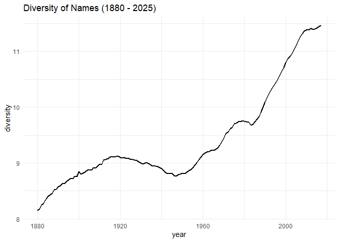

``` r
# load libraries
library(babynames)
library(readxl)
library(tidyverse)
```

# Tableau Dashboard can be found [here](https://public.tableau.com/app/profile/sarthak.sunil.dhanke/viz/babynames_17555814559760/Dashboard1)

# Merge all the .txt files downloaded from [SSA](https://www.ssa.gov/oact/babynames/limits.html)

# Diversity Index:

The **Diversity Index** of baby names measures how widely births are
distributed across different names in a given year. It is commonly
calculated using *Shannon entropy*, which captures both the number of
distinct names and the evenness of their use. The formula is

$$
H = - \sum_{i=1}^{N} p_i \, \log_2(p_i)
$$

where $p_i$ is the proportion of babies given name $i$, and $N$ is the
total number of distinct names in that year. Higher values of $H$
indicate greater diversity — that is, parents are spreading choices
across many names more evenly — while lower values indicate
concentration around fewer dominant names. This index is useful for
studying cultural trends, such as shifts from conformity toward
individuality in naming practices.

``` r
# create diversity index which entropy measure of names
diversity <- babynames |>
    group_by(year, name) |> 
    summarise(n = sum(n)) |> 
    mutate(total = sum(n), p = n / total) |> 
    summarise(diversity = -sum(p * log2(p))) # entropy
```

    ## `summarise()` has grouped output by 'year'. You can override using the
    ## `.groups` argument.

``` r
diversity
```

    ## # A tibble: 138 × 2
    ##     year diversity
    ##    <dbl>     <dbl>
    ##  1  1880      8.16
    ##  2  1881      8.18
    ##  3  1882      8.25
    ##  4  1883      8.28
    ##  5  1884      8.36
    ##  6  1885      8.40
    ##  7  1886      8.43
    ##  8  1887      8.46
    ##  9  1888      8.52
    ## 10  1889      8.53
    ## # ℹ 128 more rows

# Diversity Trend (1880 - 2025)

The **diversity index of baby names** shows a clear U-shaped trend over
the 20th century, reflecting different social and demographic forces at
work. From 1880 to about 1920, diversity rose as mass immigration from
Southern and Eastern Europe introduced many new naming traditions into
the U.S. population. This broadened the cultural pool of names and
reduced the dominance of a narrow Anglo-Protestant set. Between the
1920s and 1950s, however, diversity declined due to restrictive
immigration laws. After the 1950s, the trend reversed again, with
diversity steadily climbing. The baby boom increased the absolute number
of children, the 1965 Immigration and Nationality Act re-opened the U.S.
to new migrant groups, and later decades saw counter-cultural movements
and a stronger emphasis on individuality. Together these forces explain
why the diversity index follows a U-shape, balancing periods of cultural
influx with periods of consolidation.

``` r
# diversity plot (tableau plot 1)
diversity |> 
    ggplot(aes(year, diversity)) +
    geom_line(linewidth = 1) +
    labs(title = "Diversity of Names (1880 - 2025)") +
    theme_minimal()
```

<!-- -->

# [Foreign-Born Population of US](https://www.census.gov/library/working-papers/2006/demo/POP-twps0081.html)

The foreign-born population data used in this analysis comes from the
U.S. Census Bureau’s comprehensive historical dataset, “Historical
Census Statistics on the Foreign-Born Population of the United States:
1850 to 2000”. This dataset, compiled by Campbell Gibson and Kay Jung,
provides decennial census statistics on the foreign-born population
including total numbers and regional composition by continent of origin
(Europe, Asia, Africa, Latin America, Northern America, and Oceania).
The data spans from 1850, when nativity questions were first included in
the U.S. Census, through 2000, capturing major immigration waves and
policy changes. Notably, the dataset has a gap for 1940 and 1950, as
immigration data by country of birth during these years was limited
almost entirely to the White population due to census collection
practices of that era. This historical dataset allows us to examine how
immigration policy shifts, particularly the restrictive Johnson-Reed Act
of 1924 and the liberalizing Immigration and Nationality Act of 1965,
affected both the volume and regional composition of America’s
foreign-born population.

## Data Preprocessing

``` r
raw_data <- read_excel("./data/table02.xlsx", sheet = "Table 2", col_names = FALSE)
```

    ## New names:
    ## • `` -> `...1`
    ## • `` -> `...2`
    ## • `` -> `...3`
    ## • `` -> `...4`
    ## • `` -> `...5`
    ## • `` -> `...6`
    ## • `` -> `...7`
    ## • `` -> `...8`
    ## • `` -> `...9`
    ## • `` -> `...10`

``` r
numbers_data <- raw_data[10:22, 1:10]
colnames(numbers_data) <- c(
    "Year",
    "Total_Foreign_Born", 
    "Region_Reported_Total",
    "Europe",
    "Asia", 
    "Africa",
    "Oceania",
    "Latin_America",
    "Northern_America",
    "Region_Not_Reported"
)
numbers_data
```

    ## # A tibble: 13 × 10
    ##    Year  Total_Foreign_Born Region_Reported_Total Europe   Asia   Africa Oceania
    ##    <chr> <chr>              <chr>                 <chr>    <chr>  <chr>  <chr>  
    ##  1 1990* 19767316           18959158              4350403  49790… 363819 104145 
    ##  2 1980* 14079906           13192563              5149572  25397… 199723 77577  
    ##  3 1970* 9619302            9303570               5740891  824887 80143  41258  
    ##  4 1960* 9738091            9678201               7256311  490996 35355  34730  
    ##  5 1930  14204149           14197553              11784010 275665 18326  17343  
    ##  6 1920  13920692           13911767              11916048 237950 16126  14626  
    ##  7 1910  13515886           13506272              11810115 191484 3992   11450  
    ##  8 1900  10341276           10330534              8881548  120248 2538   8820   
    ##  9 1890  9249547            9243535               8030347  113383 2207   9353   
    ## 10 1880  6679943            6675875               5751823  107630 2204   6859   
    ## 11 1870  5567229            5563637               4941049  64565  2657   4028   
    ## 12 1860  4138697            4134809               3807062  36796  526    2140   
    ## 13 1850  2244602            2202625               2031867  1135   551    588    
    ## # ℹ 3 more variables: Latin_America <chr>, Northern_America <chr>,
    ## #   Region_Not_Reported <chr>

``` r
# Remove asterisks from years and convert to numeric
numbers_data$Year <- as.numeric(str_remove_all(numbers_data$Year, "\\*|\\s"))

# Convert all numeric columns, handling NAs
numeric_cols <- colnames(numbers_data)[-1]  # All except Year

numbers_data <- numbers_data %>%
mutate(across(all_of(numeric_cols), ~ as.numeric(.)))

# Sort by year (ascending order)
numbers_data <- numbers_data %>%
  arrange(Year) %>%
  filter(!is.na(Year)) |>  # Remove any rows without valid years
  pivot_longer(cols = -c(Year, Total_Foreign_Born, Region_Reported_Total), names_to = "Region", values_to = "Population") # pivot longer

numbers_data
```

    ## # A tibble: 91 × 5
    ##     Year Total_Foreign_Born Region_Reported_Total Region              Population
    ##    <dbl>              <dbl>                 <dbl> <chr>                    <dbl>
    ##  1  1850            2244602               2202625 Europe                 2031867
    ##  2  1850            2244602               2202625 Asia                      1135
    ##  3  1850            2244602               2202625 Africa                     551
    ##  4  1850            2244602               2202625 Oceania                    588
    ##  5  1850            2244602               2202625 Latin_America            20773
    ##  6  1850            2244602               2202625 Northern_America        147711
    ##  7  1850            2244602               2202625 Region_Not_Reported      41977
    ##  8  1860            4138697               4134809 Europe                 3807062
    ##  9  1860            4138697               4134809 Asia                     36796
    ## 10  1860            4138697               4134809 Africa                     526
    ## # ℹ 81 more rows

``` r
# save the file to upload to tableau
write_csv(numbers_data, "./data/foreign_born_population.csv")
```

``` r
# merge the population data with diversity data 
numbers_data |> 
  select(Year, Total_Foreign_Born) |>
  distinct(Year, Total_Foreign_Born) |> 
  inner_join(diversity, join_by(Year == year)) |> 
  write_csv("./data/diversity_total_foreign_born.csv")
```

# Supplementary Analysis

``` r
top10 <- babynames |> 
    group_by(year, sex) |> 
    mutate(rank = rank(-n), total = sum(n)) |> 
    filter(rank <= 10) |> 
    summarize(top10_share = sum(n) / max(total), .groups = "drop") |> 
    group_by(year) |> 
    summarise(mean_share = mean(top10_share))
top10
```

    ## # A tibble: 138 × 2
    ##     year mean_share
    ##    <dbl>      <dbl>
    ##  1  1880      0.344
    ##  2  1881      0.340
    ##  3  1882      0.333
    ##  4  1883      0.330
    ##  5  1884      0.322
    ##  6  1885      0.317
    ##  7  1886      0.313
    ##  8  1887      0.299
    ##  9  1888      0.304
    ## 10  1889      0.301
    ## # ℹ 128 more rows

``` r
two_effect <- diversity |> 
    inner_join(top10, join_by(year))
two_effect
```

    ## # A tibble: 138 × 3
    ##     year diversity mean_share
    ##    <dbl>     <dbl>      <dbl>
    ##  1  1880      8.16      0.344
    ##  2  1881      8.18      0.340
    ##  3  1882      8.25      0.333
    ##  4  1883      8.28      0.330
    ##  5  1884      8.36      0.322
    ##  6  1885      8.40      0.317
    ##  7  1886      8.43      0.313
    ##  8  1887      8.46      0.299
    ##  9  1888      8.52      0.304
    ## 10  1889      8.53      0.301
    ## # ℹ 128 more rows
